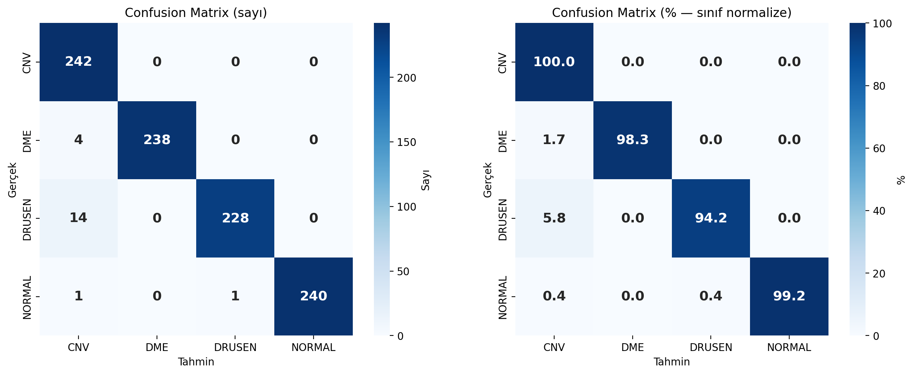
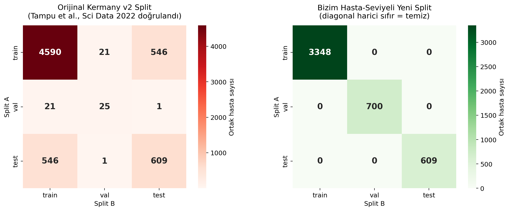

# Retinal OCT Disease Classification

Classifying retinal OCT scans into **CNV, DME, Drusen and Normal** with two modern approaches, on a patient-disjoint split of the Kermany OCT2017 dataset:

- **ConvNeXt-V2-Tiny**, fully fine-tuned from ImageNet-22k weights
- **RETFound** (ViT-Large foundation model for retinal images, Zhou et al., *Nature* 2023) adapted with **LoRA**, training only 1.6 M of its 303 M parameters

## Results (held-out test set, 968 images)

| Model | Trainable params | Accuracy | Macro F1 | Cohen's κ | Macro AUROC |
|---|---|---|---|---|---|
| ConvNeXt-V2-Tiny | 28 M | 97.9% | 0.979 | 0.972 | 0.999 |
| RETFound + LoRA (r=16) | 1.6 M | **98.8%** | **0.988** | **0.983** | – |

ConvNeXt 95% bootstrap CI for accuracy: 97.0% – 98.9%.

| ConvNeXt-V2 | RETFound + LoRA |
|---|---|
|  |  |

## Fixing data leakage in the original split

The widely used Kermany v2 split puts images from the **same patient** in both training and test sets. The EDA script found that **546 of 609 test patients (89.7%) also appear in train/val**, so scores reported on that split are inflated (consistent with Tampu et al., 2022).

This project rebuilds the split at the **patient level** (stratified by class) and verifies zero patient overlap between train, validation and test. The final splits are in [`outputs/splits/`](outputs/splits).



| Split | Images |
|---|---|
| Train | 45,146 |
| Validation | 10,677 |
| Test | 968 (balanced, 242 per class) |

## Training setup

| | ConvNeXt-V2-Tiny | RETFound + LoRA |
|---|---|---|
| Pretraining | FCMAE + ImageNet-22k → 1k | MAE on 736k OCT images |
| Loss | Weighted cross-entropy, label smoothing 0.1 | same |
| Optimizer | AdamW, cosine schedule, 5 warm-up epochs | AdamW, layer-wise LR decay 0.65 |
| Epochs / batch | 30 / 32 | 30 / 16 (gradient checkpointing) |
| Precision | bf16 AMP | bf16 AMP |
| Model selection | Best validation macro F1 | same |

Trained on a single RTX 3060.

## Pipeline

| Script | What it does |
|---|---|
| `01_eda_split.py` | Indexes the dataset, class/patient statistics, leakage audit, patient-level split |
| `02_fix_and_finalize.py` | Builds the balanced test set and final splits, re-checks leakage |
| `03_test_setup.py` | Smoke test for the data pipeline and augmentations |
| `04_train_convnext.py` | Trains ConvNeXt-V2, logs metrics, saves confusion matrix and curves |
| `05_train_retfound.py` | Loads RETFound from Hugging Face, adds LoRA adapters, trains |
| `06_evaluate_checkpoint.py` | Evaluates a saved checkpoint with bootstrap confidence intervals |
| `src/dataset.py` | PyTorch dataset with Albumentations transforms |
| `src/retfound.py` | RETFound checkpoint loading |

## Running

1. Download [Kermany OCT2017](https://data.mendeley.com/datasets/rscbjbr9sj/2) and point the scripts to it:
   ```bash
   export OCT_DATA_ROOT=/path/to/OCT2017      # Windows: $env:OCT_DATA_ROOT="C:\data\OCT2017"
   ```
2. Install PyTorch for your CUDA version, then the rest:
   ```bash
   pip install torch torchvision --index-url https://download.pytorch.org/whl/cu121
   pip install -r requirements.txt
   ```
3. Run the scripts in order. The provided splits let you skip steps 1–2.
4. For RETFound, request access at [YukunZhou/RETFound_mae_natureOCT](https://huggingface.co/YukunZhou/RETFound_mae_natureOCT) and set `HF_TOKEN`.

Training curves, per-class reports and configs for both runs are in [`results/`](results).
